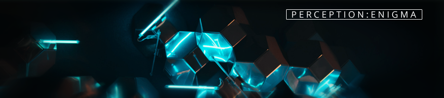

**perception:enigma** is an online platform hosting a range of puzzles and challenges that were created by **Linn Ruth Friberg (LRF)**. This platform offers a challenging and engaging experience for those who enjoy solving puzzles and riddles. The puzzles are designed to push the limits of your brainpower and test your ability to think critically and logically. Each challenge presents a unique scenario that requires careful analysis, observation, and reasoning to arrive at the correct solution. As you delve deeper into the world of perception:enigma, you'll find that the puzzles become increasingly complex and intricate. From deciphering cryptic messages through research to unraveling complex sequences, every challenge requires you to employ a new set of skills and techniques. LRF strives to construct a coherent narrative within the puzzle series, resulting in an intricately detailed final product.

The entire range of puzzles can be found in the [Data Echoes database](https://github.com/linfri/DataEchoes/blob/main/DataEchoes.html).

## Latest Changes

[2023-05-07] Severely under construction at the moment.

[2023-05-07] The first puzzles, including the reworked version of Oriondrive, will be posted around June.
